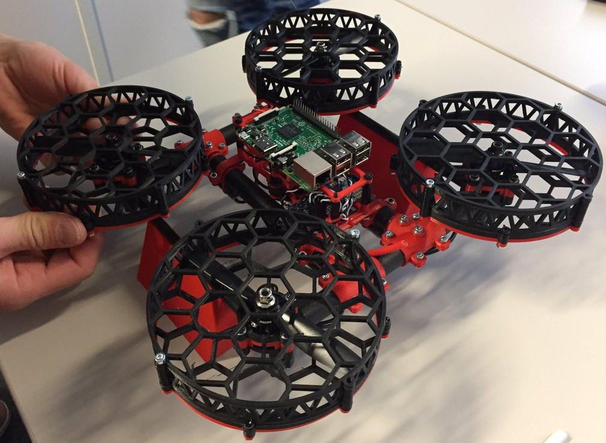

=========

Glue between all Elicopter components.

## Frame



> Note: STL files are coming soon on Thingiverse.

## Software

`Core` repository:
```
git clone https://github.com/elicopter/core.git
```

`Ground Station` repository:
```
git clone https://github.com/elicopter/ground-station.git
```

`Elicopter System RPI3` repository (fork of nerves_system_rpi3):
```
git clone https://github.com/elicopter/elicopter_system_rpi3
```

### Run

* To run `core`, check the project documentation [here](https://github.com/elicopter/core).
* To run `ground-station`, check the project documentation [here](https://github.com/elicopter/ground_station).


## Bill of Material (Coming soon)

## Contributing

Please read [CONTRIBUTING.md](CONTRIBUTING.md) for details on our code of conduct, and the process for submitting pull requests to us.

## License

This project is licensed under the MIT License - see the [LICENSE.md](LICENSE.md) file for details

